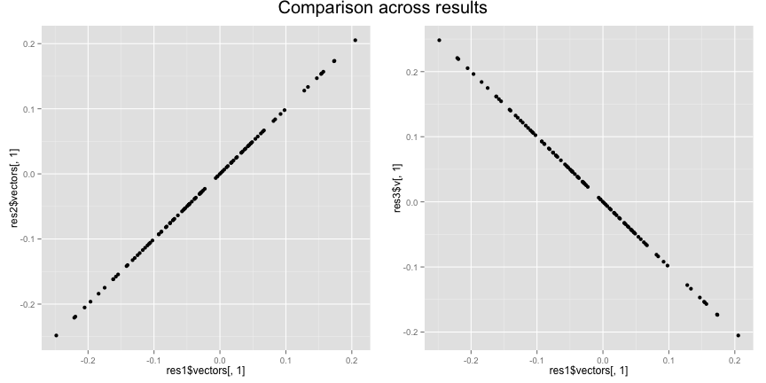

--- 
title       : Eigendecomposition vs SVD
subtitle    : 
author      : Nan Wang
job         : 
framework   : io2012        # {io2012, html5slides, shower, dzslides, ...}
highlighter : highlight.js  # {highlight.js, prettify, highlight}
hitheme     : tomorrow      # 
widgets     : [mathjax]            # {mathjax, quiz, bootstrap}
mode        : selfcontained # {standalone, draft}
knit        : slidify::knit2slides
---

## Basics
The two approaches that are primarily used in principle components analysis (PCA) are
* Eigendecomposition <br>
$$ A = Q \Lambda Q^{-1} (Q \Lambda Q^T \:\text{if A is symmetric}) $$ <br>
where $Q$ is usually orthonormal

* Singular Value Decomposition (SVD) <br>
$$ B = U \Sigma V^T $$


ref links:

http://en.wikipedia.org/wiki/Eigendecomposition_of_a_matrix <br>
http://en.wikipedia.org/wiki/Singular_value_decomposition

---

## Eigendecomposition vs SVD in PCA
In PCA, the PC's are eigenvectors of the the covariance (or correlation) matrix $R$ of a given p-by-n data matrix $X$. The sample covariance matrix of the columns of $X$ has entries <br>
$$ a_{jk} = \frac{1}{n-1}\sum_{i=1}^n (x_{ij}-\bar{x_{j}})(x_{ik}-\bar{x_{k}}) $$

So people always center (and/or scale) matrix $X$ so that the covariance $R$ is just multiplying $X^TX$ with a scalar 1/(n-1). Given $X=U \Sigma V^T$ it then can be shown that using SVD <br>
$$ X^TX = V \Sigma^T U^TU \Sigma V^T = V\Sigma^2V^T $$
whereas using eigendecomposition on $R$ gives <br>
$$ R = Q \Lambda Q^T$$
Therefore $V = Q$ and $\Lambda = \Sigma^2$

---

## Example

1. Simulate data
    
    ```r
    seed = 123
    x = matrix(sample(1:10,size = 1000,replace = T),nrow = 10)    #a 50x20 matrix
    x_c = apply(x,2,function(v) v-mean(v))    #center the data
    ```

2. Compute the eigenvectors using eigendecomposition
    
    ```r
    res1 = eigen(cov(x))    #on covariance
    res2 = eigen(t(x_c)%*%x_c)    #on x'x
    ```

3. Compute the eigenvectors using SVD
    
    ```r
    res3 = svd(x_c)
    ```

---

## Example


```r
p1 <- qplot(res1$vectors[,1],res2$vectors[,1])
p2 <- qplot(res1$vectors[,1],res3$v[,1])
grid.arrange(p1, p2, nrow = 1,main=textGrob("Comparison across results",gp=gpar(fontsize=20)))
```

 
